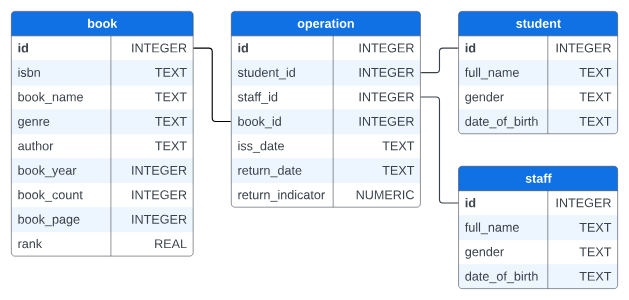

# Stage 4/4: Verify data
## Description
In a real library, hundreds of students borrow hundreds of different books every day. By combining different tables,  
we can solve all kinds of problems that arise. For example, having received a fresh sequel of "Harry Potter",  
we can easily choose exactly those students who are most likely to be interested in it and offer it to them.

## Objectives
- Write a query where we can find the names of the students who bought the book with `id = 2`.  
- The results should be sorted by `full_name`, and you should build your query using the `JOIN` keyword.

## Explanation of the database
Let's remember what our database looks like:



The ` **book** ` table  contains information about all the books in the library:  
- `id`: integer Primary key,
- `isbn`: a unique 13-digit identifier for books and book-like products as TEXT,
- `book_name`: title as TEXT,  
- `author`: author's name as TEXT,  
- `genre`: genre as TEXT,  
- `book_page`: number of pages as INTEGER 
- `book_year`: year of publication as INTEGER,  
- `rank`: rating as REAL,  
- `available`: how many books are available

The ` **student** ` table includes information about readers:
- `id`: integer, Primary key
- `full_name`: students name as TEXT
- `gender`: students gender as TEXT
- `date_of_birth`: students birthdate as TEXT

The ` **staff** ` table includes information about the employees who issue books:
- `id`: integer, Primary key
- `full_name`: employee name as TEXT
- `gender`: employee gender as TEXT
- `date_of_birth`: employee birthdate as TEXT

The ` **operation** ` table includes information about transactions that have occurred:
- `id`: integer Primary key
- `staff_id`: INTEGER Foreign key from `staff` table, 
- `student_id`: INTEGER Foreign key from `student` table,
- `book_id`: INTEGER Foreign key from `book` table,
- `iss_date`: the date of issue as TEXT,  
- `return_date`: the planned return date as TEXT,  
- `return_indicator`: state of issued book as NUMERIC: `issued — 0`, `returned — 1`

## Example
🤔 Do not delete the code you've composed in the previous stage. Assign your queries to the variables, as in the example.  
It is required for testing only.

### Example 1: an extract from the program
```markdown
student_inf = "SELECT full_name FROM ... ;"
```